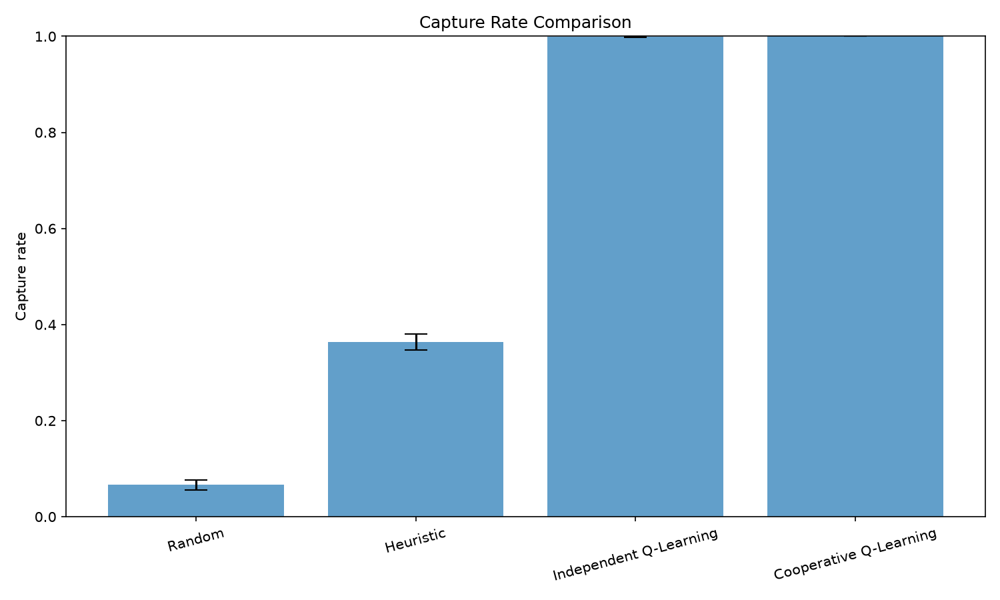
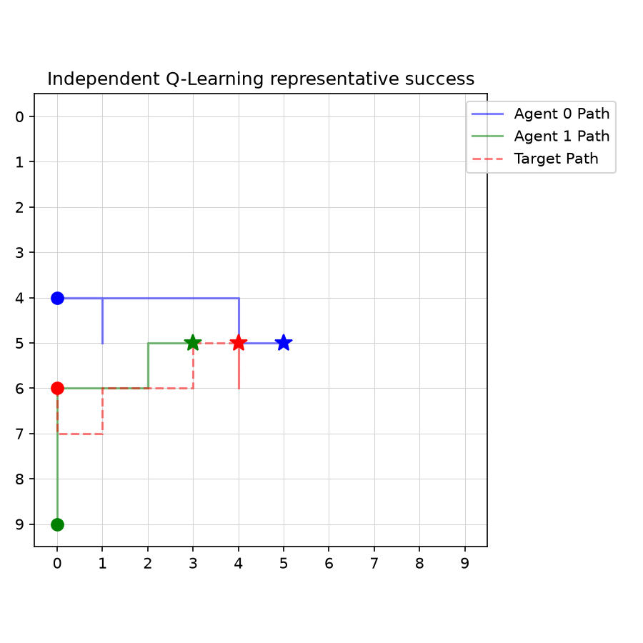
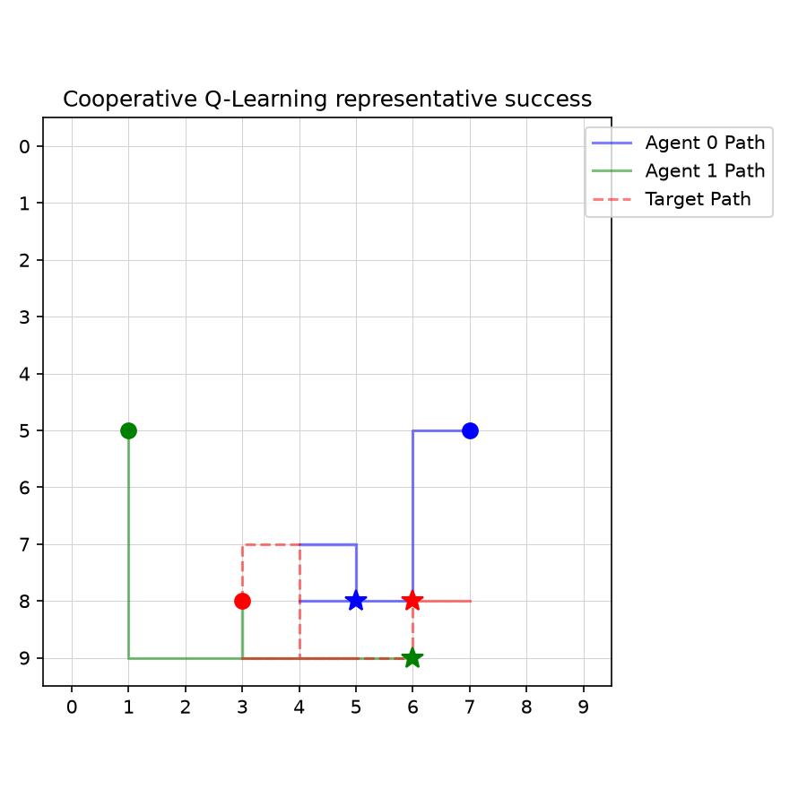
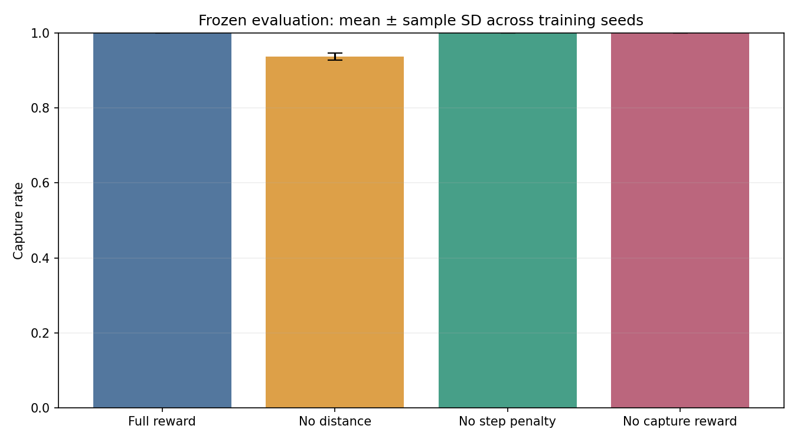
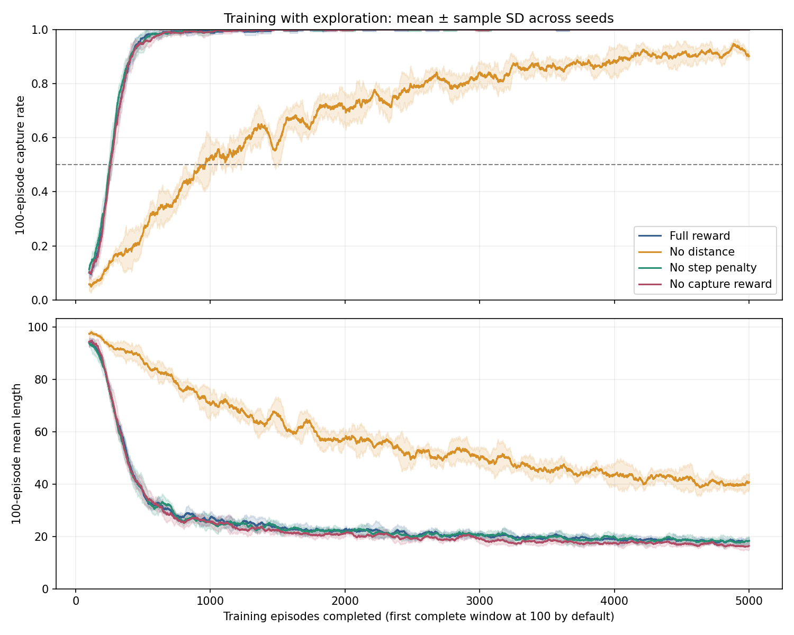
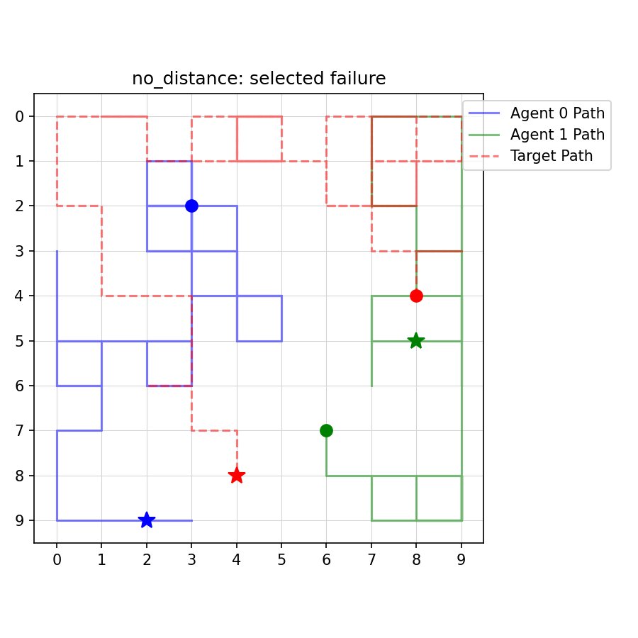

# Emergent Cooperation in Multi-Agent Reinforcement Learning for Target Capture

This repository is an interpretable multi-agent reinforcement learning study in a deterministic, seeded GridWorld. Two hunters pursue a moving random target. Capture occurs when both hunters are Manhattan-adjacent to the target at the same time.

## Current status

Phases 0–13 are implemented and validated:

- GridWorld, movement, collision handling, target policy, capture, and rendering
- team reward and non-learning Random and Heuristic baselines
- Independent Q-Learning with one table per hunter
- Shared-Policy Cooperative Q-Learning with one table used by both hunters
- five-seed quantitative comparison
- frozen-policy trajectory recording, behavioral metrics, plots, and GIFs
- deterministic reproduction checks for raw data, training histories, summaries, and checkpoints
- controlled five-seed reward ablation, learning-speed analysis, and behavioral comparison

Deep MARL, learned communication, continuous actions, and statistical hypothesis testing are outside the current scope.

## Environment and reward

The default experiment uses a `10 × 10` grid, a 100-step limit, two hunters, and one target. Every entity chooses from `UP`, `DOWN`, `LEFT`, `RIGHT`, and `STAY`. Hunter actions are chosen from the same pre-step state, applied sequentially, and followed by the target action. Entities cannot move outside the grid or into an occupied cell.

The shared team reward is:

```text
sum of both hunters' reductions in Manhattan distance to the moving target
+ 20 on capture
- 0.05 each step
```

Capture has zero Q-learning bootstrap value. Time-limit truncation retains bootstrap value.

## Learning methods

### Independent Q-Learning

Each hunter owns a separate sparse table. Its absolute state key is:

```text
(hunter_x, hunter_y, target_x, target_y)
```

### Shared-Policy Cooperative Q-Learning

Two logical hunter wrappers use one sparse Q-table and one policy architecture. Each hunter encodes the same environment state from its own perspective:

```text
(target_dx, target_dy, teammate_dx, teammate_dy)
```

Both actions are selected before the environment step. The resulting team reward updates the shared table once for each hunter transition.

Both methods use seeded epsilon-greedy action selection with random tie-breaking. Evaluation sets epsilon to zero and treats unseen states as zero-valued without adding them to a table.

## Reproduced Phase 11 protocol

- training seeds: `0, 1, 2, 3, 4`
- learning episodes: 5,000 per method and seed
- evaluation episodes: 500 per method and seed
- evaluation seed range: 10,000,000–10,002,499
- evaluation uses frozen policies and the same environment seeds for every method
- uncertainty: mean ± sample standard deviation across five independent seed-level estimates

Two complete executions produced byte-identical raw CSVs, training histories, summary tables, curve-source data, and all 15 learned checkpoints.

### Quantitative results

| Method | Capture rate | Episode length | Capture time on successes | Episode reward |
|---|---:|---:|---:|---:|
| Random | 0.0660 ± 0.0101 | 96.1988 ± 0.4606 | 42.1298 ± 2.7820 | -2.5575 ± 0.5226 |
| Heuristic | 0.3636 ± 0.0162 | 66.4816 ± 1.5012 | 7.8159 ± 0.1103 | 14.0743 ± 0.4557 |
| Independent Q-Learning | 0.9992 ± 0.0011 | 20.2772 ± 0.7763 | 20.2131 ± 0.8073 | 30.3193 ± 0.0657 |
| Cooperative Q-Learning | 1.0000 ± 0.0000 | 16.8412 ± 0.4470 | 16.8412 ± 0.4470 | 30.5079 ± 0.0755 |

Both learned methods captured the target in nearly every episode. Under this protocol, the shared-policy method completed episodes about 3.44 steps sooner on average than Independent Q-Learning. These descriptive results do not establish statistical significance or isolate whether teammate-relative state, parameter sharing, or their combination caused the difference.

The exact summary is in [comparison_summary.csv](results/reproducibility/summaries/comparison_summary.csv), with seed-level values in [per_seed_summary.csv](results/reproducibility/summaries/per_seed_summary.csv).



## Phase 12 behavioral analysis

Behavioral analysis reused the five reproduced checkpoint sets and the same 500 evaluation episodes per seed. Policies remained frozen, and every recorded transition includes the actual hunter actions, target action, reward, positions, termination flags, checkpoint identity, and selection rule.

### Behavioral metrics

Metrics are averaged within each training seed first, followed by mean ± sample standard deviation across five seed-level estimates.

| Method | Mean target distance | Hunter separation | Simultaneous adjacency fraction | Distinct-side fraction |
|---|---:|---:|---:|---:|
| Random | 6.5217 ± 0.0262 | 6.6673 ± 0.0430 | 0.0038 ± 0.0003 | 0.0038 ± 0.0003 |
| Heuristic | 2.6032 ± 0.0314 | 2.6826 ± 0.1108 | 0.0501 ± 0.0025 | 0.0501 ± 0.0025 |
| Independent Q-Learning | 3.5364 ± 0.0316 | 4.0453 ± 0.1273 | 0.0700 ± 0.0033 | 0.0700 ± 0.0033 |
| Cooperative Q-Learning | 4.0687 ± 0.0408 | 4.4486 ± 0.1180 | 0.0780 ± 0.0027 | 0.0780 ± 0.0027 |

The shared-policy agents captured sooner while maintaining greater mean separation than the independent agents. Their simultaneous-adjacency fraction was also higher. Since episodes terminate immediately at capture, simultaneous adjacency largely reflects capture frequency and episode duration. Since collision handling already prevents hunters from occupying the same cell, the current distinct-side indicator equals simultaneous adjacency in this environment. These metrics provide evidence consistent with more efficient positioning, but they do not independently demonstrate stable roles or a general pincer strategy.

The full seed-level table is [behavioral_seed_summary.csv](results/reproducibility/behavioral/behavioral_seed_summary.csv).

### Representative episodes

A representative success is the successful episode whose capture time is closest to that method's median successful capture time. Ties are resolved by training seed and then evaluation seed. A learned-policy failure is the first failure under the same seed ordering.

| Method | Selected success | Evaluation seed | Length |
|---|---:|---:|---:|
| Random | training seed 1 | 10,000,904 | 38 |
| Heuristic | training seed 0 | 10,000,063 | 8 |
| Independent Q-Learning | training seed 0 | 10,000,009 | 17 |
| Cooperative Q-Learning | training seed 0 | 10,000,010 | 15 |

Independent Q-Learning failed in 2 of 2,500 evaluation episodes. The saved failure is training seed 0, evaluation seed 10,000,451; both hunters stayed relatively close to the target but never became adjacent simultaneously before the 100-step truncation. Cooperative Q-Learning had no failures in the complete 2,500-episode dataset, so no cooperative failure trajectory was fabricated.

| Independent Q-Learning | Shared-Policy Cooperative Q-Learning |
|---|---|
|  |  |
| [Representative success GIF](results/reproducibility/gifs/independent_q_learning_success.gif) | [Representative success GIF](results/reproducibility/gifs/cooperative_q_learning_success.gif) |

Selection details and trajectory paths are recorded in [representative_selection.csv](results/reproducibility/behavioral/representative_selection.csv). Machine-readable trajectories are under [results/reproducibility/trajectories](results/reproducibility/trajectories/).

## Reward Ablation Study

Phase 13 tests how each reward component affects learning speed, capture success, efficiency, and positioning. Every condition uses the existing Shared-Policy Cooperative Q-Learning method, trained from an empty table. The full-reward condition was retrained independently; its five checkpoints and 2,500 evaluation rows exactly match the reproduced Phase 11 cooperative baseline.

The reward equation is:

```text
D_t = sum_i Manhattan(hunter_i,t, target_t)
r_t = distance_weight * (D_(t-1) - D_t)
      + capture_weight * indicator(capture at t)
      + step_penalty
```

Both previous and current distances use the target position at their respective times. The distance contribution is a sum, the capture bonus is added once, and the step penalty is added once per environment transition. Each hunter's update receives the same team reward; episode reward adds it once per transition. Setting capture weight to zero preserves capture detection, termination, and zero terminal bootstrap.

| Variant | Distance weight | Capture weight | Step penalty |
|---|---:|---:|---:|
| `full_reward` | 1.0 | 20.0 | -0.05 |
| `no_distance` | 0.0 | 20.0 | -0.05 |
| `no_step_penalty` | 1.0 | 20.0 | 0.0 |
| `no_capture_reward` | 1.0 | 0.0 | -0.05 |

The controlled protocol uses a 10 × 10 grid, 100-step limit, seeds `0, 1, 2, 3, 4`, 5,000 training episodes and 500 evaluation episodes per condition and seed. Learning rate is 0.1, gamma is 0.95, and epsilon starts at 1.0, decays by 0.995 after each episode, and has a minimum of 0.05. The state representation, hunter update order, movement rules, target policy, and termination/truncation handling are unchanged.

For seed index `j` and zero-based episode `e`, training environment seeds are `j * 1,000,000 + e`; training action RNGs start at `2 * training_seed` and `2 * training_seed + 1`. Evaluation environment seeds are `10,000,000 + j * 500 + e`, spanning 10,000,000–10,002,499; evaluation action RNGs start at `20,000,000 + 2*j` and the next integer. All variants share these schedules and RNG initializations. Fresh evaluation wrappers load each checkpoint, use epsilon zero, and perform no learning. Seeded random tie-breaking remains active. Quantitative and behavioral metrics use the same recorded rollouts, whose Q-tables are checked for unchanged values and membership before and after evaluation.

### Measured results

Metrics are calculated within each training seed first, then reported as mean ± **sample standard deviation across five independent training-seed estimates**. Each condition has 2,500 evaluation episodes. Capture time uses successful episodes only; all five seeds contributed for every condition in this study. In general, zero-success seeds have NaN capture time and are excluded with an explicit valid-seed count; if none contribute, the result is N/A. Sample SD is N/A when fewer than two valid seeds contribute.

| Variant | Capture rate | Capture time (successes) | Episode length (all) | Episode reward |
|---|---:|---:|---:|---:|
| Full reward | 1.0000 ± 0.0000 | 16.8412 ± 0.4470 | 16.8412 ± 0.4470 | 30.5079 ± 0.0755 |
| No distance | 0.9372 ± 0.0099 | 32.4607 ± 1.1130 | 36.7068 ± 0.8946 | 16.9087 ± 0.2079 |
| No step penalty | 1.0000 ± 0.0000 | 16.9244 ± 0.5954 | 16.9244 ± 0.5954 | 31.3500 ± 0.0942 |
| No capture reward | 1.0000 ± 0.0000 | 15.6696 ± 0.4765 | 15.6696 ± 0.4765 | 10.5665 ± 0.1020 |

**Episode rewards use different definitions and must not rank cross-variant success.** The primary metric is capture rate. Full reward, no step penalty, and no capture reward each succeeded in all 2,500 evaluation episodes. No distance succeeded in 2,343 episodes and failed in 157. Removing distance shaping increased all-episode duration by 19.8656 steps. Removing the step penalty changed duration by only +0.0832 steps. Removing the capture bonus preserved complete evaluation success and reduced duration by 1.1716 steps in this run. These observations do not establish statistical significance or universal necessity of any component.

Exact results and valid-seed counts are in [reward_ablation_summary.csv](results/ablations/summaries/reward_ablation_summary.csv) and [per_seed_summary.csv](results/ablations/summaries/per_seed_summary.csv).



### Learning speed

The predefined threshold is a rolling capture rate ≥ 0.50 over a **complete 100-episode window**. The crossing time is the number of episodes completed at the first qualifying window: the stored episode index is zero-based, so index 99 corresponds to 100 episodes completed. Partial initial windows cannot qualify and are saved as NaN. A seed that never qualifies is reported as **Not reached**; threshold-time summaries are conditional on attainment.

| Variant | Reached seeds | Episodes completed at threshold, conditional mean ± sample SD |
|---|---:|---:|
| Full reward | 5/5 | 254.6 ± 6.7 |
| No distance | 5/5 | 921.6 ± 88.5 |
| No step penalty | 5/5 | 253.2 ± 11.4 |
| No capture reward | 5/5 | 260.2 ± 9.3 |

Without distance shaping, threshold attainment required about 3.62 times as many episodes. The other three conditions crossed at similar times. These are training curves with exploration, not frozen-policy evaluation curves or a guarantee of convergence.



The [learning-speed seed table](results/ablations/summaries/learning_speed_per_seed.csv) records every crossing. Figure data are saved as [learning_curve_source.csv](results/ablations/summaries/learning_curve_source.csv) and [bar_plot_source.csv](results/ablations/summaries/bar_plot_source.csv). The other required figures are [capture time](results/ablations/plots/capture_time_ablation.png) and [episode length](results/ablations/plots/episode_length_ablation.png).

### Behavioral observations

Phase 12 metrics include the initial frame and every post-transition frame. Episode-level metrics are averaged within seed and then across five seeds using sample SD.

| Variant | Mean target distance | Hunter separation | Simultaneous adjacency | Distinct-side fraction |
|---|---:|---:|---:|---:|
| Full reward | 4.0687 ± 0.0408 | 4.4486 ± 0.1180 | 0.0780 ± 0.0027 | 0.0780 ± 0.0027 |
| No distance | 4.9507 ± 0.0434 | 4.6409 ± 0.1104 | 0.0513 ± 0.0041 | 0.0513 ± 0.0041 |
| No step penalty | 4.1055 ± 0.0636 | 4.5128 ± 0.1121 | 0.0795 ± 0.0028 | 0.0795 ± 0.0028 |
| No capture reward | 4.1415 ± 0.0627 | 4.6172 ± 0.0797 | 0.0846 ± 0.0023 | 0.0846 ± 0.0023 |

No distance maintained larger average hunter-to-target distances and captured more slowly. The no-capture condition achieved faster capture despite a slightly larger mean distance, showing that mean proximity alone does not measure capture efficiency. Collision rules make distinct-side positioning equivalent to simultaneous adjacency. Immediate termination at capture couples both adjacency fractions to capture frequency and episode duration. These indicators do not independently prove cooperation or stable roles.

Representative successes minimize distance from the variant's median successful capture time, with ties resolved by training seed and evaluation seed. Failures use the first failure in that same seed ordering. Selected successes all use training seed 0: full reward at evaluation seed 10,000,010 (15 steps), no distance at 10,000,057 (27 steps), no step penalty at 10,000,039 (15 steps), and no capture reward at 10,000,010 (13 steps).

The selected no-distance failure, training seed 0 / evaluation seed 10,000,065, runs for all 100 steps. Its mean hunter-to-target distance is 7.4554 and mean separation is 10.4950; the hunters end 3 and 7 Manhattan steps from the target. The recorded paths show separated movement across the grid without simultaneous adjacency. This supports a diagnosis of ineffective pursuit for this example, rather than a claim of pursuit near the target without capture. No failures occurred for the other conditions. No reward-hacking or systematic oscillation claim is supported by these selected examples.

[Behavioral summaries](results/ablations/behavioral/behavioral_summary.csv), [seed estimates](results/ablations/behavioral/behavioral_seed_summary.csv), and [selection rules](results/ablations/behavioral/representative_selection.csv) accompany five real [saved trajectories](results/ablations/trajectories/). All five selected trajectories were replayed against their environment seeds, with exact agreement in positions, actions, rewards, and termination flags.



### Interpretation and limits

Distance shaping has strong descriptive support for faster learning and more efficient capture under this budget; it is not strictly necessary, since removing it still achieved 93.72% capture. Support for an efficiency benefit from this step penalty is weak. The hypothesized necessity of the explicit capture bonus is unsupported here: removing it preserved all observed captures and produced shorter episodes. A possible explanation is that distance shaping, the remaining time penalty, and capture termination already supply enough task structure in this small tabular setting. The study does not identify that mechanism.

This is a fixed-budget, one-component-at-a-time study with five seeds, one grid size, one target policy, and one learning method. Components can interact, shaping can change state visitation, and reward weights were not optimized. A first threshold crossing is not a sustained-performance test. Descriptive seed variability is not a confidence interval or hypothesis test. The results have limited transfer to other MARL settings, larger teams, or deep learning. The full Phase 13 study was executed once; repeated tiny studies verified numerical reproducibility, and the independently retrained full-reward condition matched prior Phase 11 artifacts. No independent repeat of all four full-budget conditions is claimed.

### Reproduction and artifacts

The perfect capture rates were independently audited after the initial study. A separate evaluator reproduced all 10,000 original evaluation rows by checking capture geometry, movement, target sampling, and reward arithmetic. On a fresh seed range with 2,000 additional episodes per checkpoint, full reward, no step penalty, and no capture reward each captured in 10,000/10,000 episodes; no distance captured in 9,291/10,000. An untrained shared-table control captured in only 171/2,500 episodes. Training/evaluation seed overlap was zero, checkpoint paths and hashes were distinct across all 20 models, and evaluation left tables and checkpoint files unchanged. No leakage or inflated success accounting was found. Dense shaping still targets capture: with nonoverlapping entities, the sum of hunter distances has its minimum of 2 exactly at simultaneous adjacency. Gamma 0.95 also retains an incentive for early capture without a step penalty. See the [capture-rate audit](docs/phase13_capture_rate_audit.md) for checks, fresh results, limitations, and a reproduction command. Capture rate 1.0 describes zero observed failures in these finite samples.

The complete executed study used:

```bash
python -m experiments.run_reward_ablation --train-episodes 5000 --eval-episodes 500 --seeds 0 1 2 3 4 --output-dir results/ablations
```

Choose a fresh output directory when retraining, such as `results/ablations_reproduction`; the runner rejects an existing study configuration to protect its evidence. A fresh run always starts empty tables, never loads a prior condition for training, and writes independent checkpoints. Smoke budgets are separate:

```bash
python -m experiments.run_reward_ablation --grid-size 4 --max-steps 10 --train-episodes 10 --eval-episodes 5 --seeds 0 1 --output-dir results/ablations_smoke_new
python -m analysis.reward_ablation_analysis --output-dir results/ablations
python -m pytest -q
```

Analysis uses saved raw data and histories and requires no retraining. Raw data are retained locally but ignored in Git, so a fresh clone must reproduce them in a new output directory before running that analysis command there. The 10-episode smoke test cannot supply scientific learning-speed results.

The evidence bundle contains:

- `raw/<variant>.csv`: 10,000 evaluation rows in total, with variant, training/evaluation seed, episode, capture, length, successful capture time, and variant-specific reward
- `raw/training/<variant>_seed_<seed>.csv`: 100,000 training rows, including epsilon used/after decay and complete-window capture/length statistics
- `checkpoints/<variant>/seed_<seed>.pkl`: 20 independent tables; identities and SHA-256 hashes are saved in [checkpoint_identities.csv](results/ablations/summaries/checkpoint_identities.csv)
- `summaries/`: resolved [configuration](results/ablations/summaries/ablation_config.json), seed schedules, summaries, learning-speed results, figure sources, [verification](results/ablations/summaries/verification.json), completion status, and an [artifact manifest](results/ablations/summaries/artifact_manifest.json)
- `plots/`, `behavioral/`, and `trajectories/`: the four required figures, behavior tables, five selected trajectory JSONs, and diagnostic plots

Only narrowly listed evidence files are eligible for tracking. Large raw datasets, per-episode behavioral files, checkpoints, and smoke outputs remain ignored. All prior Phase 11/12 evidence is preserved. The pristine baseline had **90 passing tests**; the initial Phase 13 implementation passed **116 tests**, and the follow-up capture-rate audit extends the suite to **120 passing tests**. Coverage includes reward accounting, frozen unseen-state evaluation, seed aggregation, missing values, threshold conventions, fresh tables, isolated paths, default compatibility, repeated tiny-run equality, and independent capture/movement checks. Windows sandbox path-resolution failures required running tests outside that sandbox; 13 existing dependency deprecation warnings remain. See the [Phase 13 completion report](docs/phase13_reward_ablation.md) for the original implementation and verification record, and the [capture-rate audit](docs/phase13_capture_rate_audit.md) for the additional checks.

## Reproduce the results

Create an environment and install the declared dependencies:

```bash
python -m venv .venv/reproduction
.venv/reproduction/Scripts/python -m pip install -r requirements.txt
```

Run the complete test suite:

```bash
.venv/reproduction/Scripts/python -m pytest -q
```

Run two complete quantitative experiments:

```bash
.venv/reproduction/Scripts/python -m experiments.run_comparison --grid-size 10 --max-steps 100 --train-episodes 5000 --eval-episodes 500 --seeds 0 1 2 3 4 --output-dir results/validation/run_a
.venv/reproduction/Scripts/python -m experiments.run_comparison --grid-size 10 --max-steps 100 --train-episodes 5000 --eval-episodes 500 --seeds 0 1 2 3 4 --output-dir results/validation/run_b
```

Generate behavioral evidence from each checkpoint set:

```bash
.venv/reproduction/Scripts/python -m experiments.generate_behavioral_examples --grid-size 10 --max-steps 100 --eval-episodes 500 --seeds 0 1 2 3 4 --output-dir results/validation/run_a
.venv/reproduction/Scripts/python -m experiments.generate_behavioral_examples --grid-size 10 --max-steps 100 --eval-episodes 500 --seeds 0 1 2 3 4 --output-dir results/validation/run_b
```

Validate and publish lightweight evidence:

```bash
.venv/reproduction/Scripts/python -m experiments.reproducibility --run-a results/validation/run_a --run-b results/validation/run_b --seeds 0 1 2 3 4 --train-episodes 5000 --eval-episodes 500 --publish-dir results/reproducibility
```

Full raw results and checkpoints remain ignored under `results/validation/`. The tracked evidence bundle contains configuration, summaries, plot-source data, plots, representative trajectories, GIFs, and a SHA-256 [artifact manifest](results/reproducibility/artifact_manifest.json).
The independent-run comparison fingerprint and its checked scope are recorded in [reproduction_verification.json](results/reproducibility/reproduction_verification.json).

## Limitations

- The environment has only two homogeneous hunters on one small grid.
- The moving target follows one seeded random policy.
- Parameter sharing and teammate-relative observations change together, so this experiment cannot attribute the result to either factor alone.
- The behavioral indicators are simple and partly constrained by the capture and collision rules.
- Representative animations are deterministic examples selected by a documented rule; they do not replace the 2,500-episode-per-method summaries.
- No hypothesis test, confidence interval, alternate target policy, or larger-team study is included.
- The reward ablation uses a fixed budget and removes one component at a time; it does not resolve component interactions or transfer to other learning settings.

The repository is ready for Phase 14 generalization and stress testing. Phase 14 has not been implemented.
