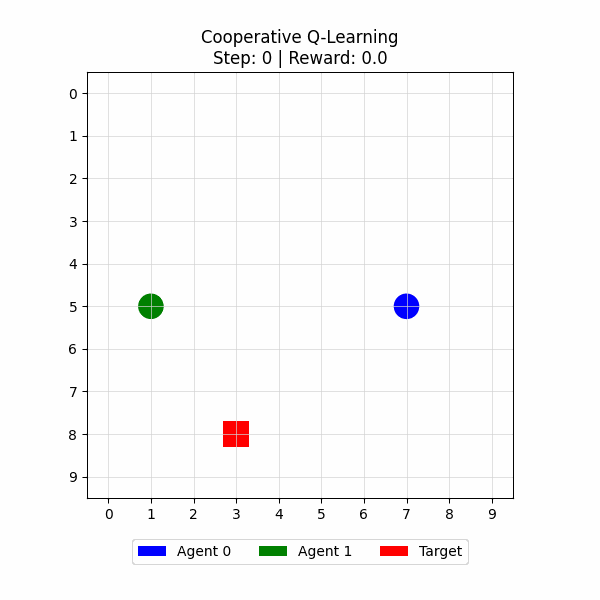
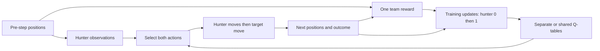
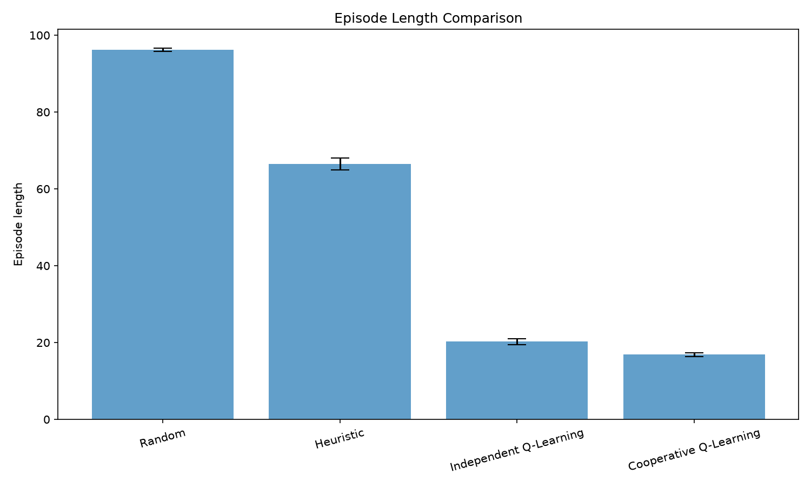
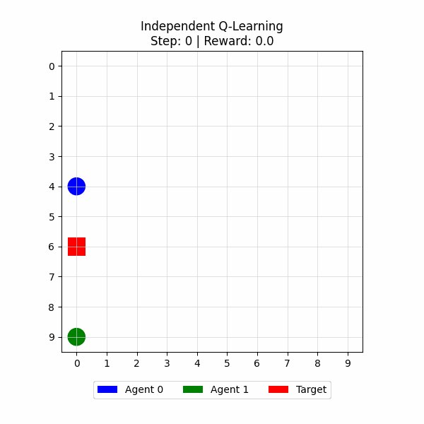

# Emergent Cooperation in Multi-Agent Reinforcement Learning for Target Capture

A reproducible, interpretable tabular study of two hunters capturing a moving target: Random and Heuristic baselines, Independent Q-Learning, and Shared-Policy Cooperative Q-Learning, with behavioral analysis, reward ablation and frozen-policy robustness evaluation.



Real Cooperative rollout, selected closest to the median successful capture time; ties use training seed and evaluation seed. [Selection and provenance](results/reproducibility/behavioral/representative_selection.csv).

## Abstract

Two hunters must become simultaneously adjacent to a random moving target in a 10×10 GridWorld. Across five independently trained seeds, shared-policy tabular Q-learning captured in all 2,500 evaluation episodes and averaged 16.84 steps, compared with 99.92% capture and 20.28 steps for independent tables. Removing distance shaping reduced capture to 93.72% and delayed learning; removing the explicit capture bonus preserved observed perfect capture. Frozen original policies retained their capture rates on fresh seeds and verified held-out reset configurations. These results demonstrate effective learned task completion in a small benchmark; they do not isolate a causal effect of parameter sharing or prove general cooperation.

## Motivation and research questions

Capturing requires both hunters to reach neighboring cells at the same time, so individual greedy pursuit may be insufficient. This small environment makes reward design, state representation and learned behavior inspectable. The study asks:

1. How do learned policies compare with random movement and horizontal-first greedy pursuit?
2. How does a shared relative-state policy compare with separate absolute-state tables?
3. Which reward components affect capture, duration and learning speed?
4. Do frozen policies retain performance on new seeds, held-out starts and spatial probes?

## Environment and formulation

The physical state contains the three distinct positions. Each hunter selects one of `UP`, `DOWN`, `LEFT`, `RIGHT`, `STAY`; the joint hunter action space has 25 combinations. Actions are chosen from the same pre-step state, applied sequentially (hunter 0 then hunter 1), and followed by target movement. Attempts to leave the grid or enter an occupied cell are blocked. The target samples uniformly among boundary-valid actions, including STAY; occupied cells can block its sampled move.

Capture occurs **after a transition when both hunters have Manhattan distance exactly one from the target**. Nonoverlap forces distinct adjacent cells; no additional opposite-side requirement exists. Capture terminates the episode; otherwise the 100-step horizon truncates it. Initial adjacency alone does not terminate at reset.

The tabular learners maximize discounted team return with discount 0.95. Their encoded observations are:

| Method | Encoded policy state | Tables |
|---|---|---|
| Independent Q-Learning | `(hunter_x, hunter_y, target_x, target_y)` | One per hunter |
| Shared-Policy Cooperative Q-Learning | `(target_dx, target_dy, teammate_dx, teammate_dy)` | One shared sparse table, two hunter wrappers |

Independent encoding omits the teammate. Cooperative deltas are measured from the acting hunter and expose teammate relationships, but omit absolute boundary information and can alias physical configurations. Neither representation is claimed to establish a fully observed Markov state. “Cooperative” names the shared policy/team-reward implementation, not a demonstrated communication or role-learning mechanism.

Let `D_t` be the **sum** of both hunters' Manhattan distances to the target at timestep `t`. The team reward is:

```text
r_t = distance_weight * (D_t - D_(t+1))
    + capture_weight * I(capture at t+1)
    + step_penalty

default weights: 1.0, 20.0, -0.05
```

Distances use the respective target position at each timestep. Reward is computed once per transition, added once to episode return and supplied to both hunter updates. Q-learning uses `Q ← Q + α[r + γ max Q(next) − Q]`, with zero bootstrap on capture and retained bootstrap on time-limit truncation. Shared-table updates run in hunter-0 then hunter-1 order after both actions have been selected.

## Methods and architecture

Random hunters sample uniformly from all five actions. The Heuristic moves toward the target horizontally first, then vertically; it does not plan around collisions or teammates. Independent Q-Learning learns separate policies. Shared-Policy Cooperative Q-Learning pools both hunters' experience into the same relative-state table. Both learned methods use learning rate 0.1, initial epsilon 1.0, episode decay 0.995 and floor 0.05.



Evaluation skips updates and freezes tables. Epsilon is zero; greedy ties use seeded randomness, and unseen-state queries return zero values without inserting keys. [Exact mechanics, schedules and evidence](docs/methods_and_evidence.md).

## Experimental protocol and main results

Five training seeds (0–4) each train both learned methods for 5,000 episodes. Every method is evaluated on the same 500 environment seeds per training run, for 2,500 episodes per method. Training and evaluation environment ranges are disjoint. Results first average episodes within seed, then average seed estimates; `±` is **sample standard deviation across five seed estimates**, not a confidence interval. Capture time is conditional on success; zero-success capture time is N/A. Episode length includes failed 100-step episodes.

| Method | Capture rate | Successful capture time | All-episode length | Episode return |
|---|---:|---:|---:|---:|
| Random | 0.0660 ± 0.0101 | 42.1298 ± 2.7820 | 96.1988 ± 0.4606 | −2.5575 ± 0.5226 |
| Heuristic | 0.3636 ± 0.0162 | 7.8159 ± 0.1103 | 66.4816 ± 1.5012 | 14.0743 ± 0.4557 |
| Independent Q-Learning | 0.9992 ± 0.0011 | 20.2131 ± 0.8073 | 20.2772 ± 0.7763 | 30.3193 ± 0.0657 |
| Cooperative Q-Learning | 1.0000 ± 0.0000 | 16.8412 ± 0.4470 | 16.8412 ± 0.4470 | 30.5079 ± 0.0755 |

The shared method's mean all-episode length is 3.436 steps shorter (about 16.9%) under this protocol. Both representation and parameter sharing change, so the comparison cannot attribute that difference solely to cooperation. The Heuristic's short successful capture time reflects conditioning on its successful subset, alongside many failures.

Values come from [generated summaries](results/reproducibility/summaries/comparison_summary.csv), [seed estimates](results/reproducibility/summaries/per_seed_summary.csv) and [configuration](results/reproducibility/summaries/experiment_config.json). Two original full-budget main runs matched across [35 byte-identical checked artifacts](results/reproducibility/reproduction_verification.json).



## Behavioral evidence

The Heuristic has smaller mean hunter-target distance (2.6032) than the learned policies (Independent 3.5364; Cooperative 4.0687), yet captures much less often. Proximity alone does not measure capture effectiveness. Cooperative simultaneous-adjacency fraction is 0.0780 versus Independent 0.0700; because capture ends the episode and collisions enforce distinct cells, this is coupled to success and duration. The recorded distinct-side indicator is mechanically redundant with simultaneous adjacency here. These observations do not prove stable roles or causal coordination.

All visualizations are real frozen-policy trajectories selected by documented rules. [Behavioral summaries](results/reproducibility/behavioral/behavioral_summary.csv), [actual trajectories](results/reproducibility/trajectories/), [GIFs](results/reproducibility/gifs/) and [metric definitions and limitations](docs/methods_and_evidence.md#behavioral-evidence) provide the evidence.



## Controlled reward ablation

Each variant retrains five fresh shared Q-tables for 5,000 episodes, then uses the same 500 evaluation episodes per seed. Only the indicated reward component changes.

| Variant `(distance, capture, step)` | Capture rate | Successful capture time | All-episode length |
|---|---:|---:|---:|
| Full reward `(1,20,−0.05)` | 1.0000 ± 0.0000 | 16.8412 ± 0.4470 | 16.8412 ± 0.4470 |
| No distance `(0,20,−0.05)` | 0.9372 ± 0.0099 | 32.4607 ± 1.1130 | 36.7068 ± 0.8946 |
| No step penalty `(1,20,0)` | 1.0000 ± 0.0000 | 16.9244 ± 0.5954 | 16.9244 ± 0.5954 |
| No capture reward `(1,0,−0.05)` | 1.0000 ± 0.0000 | 15.6696 ± 0.4765 | 15.6696 ± 0.4765 |

Removing distance shaping slowed capture and delayed the first complete 100-episode window with ≥50% capture from 254.6±6.7 to 921.6±88.5 episodes. The measured step-penalty benefit is weak, and explicit capture reward was **not necessary for observed success**. Raw returns use different definitions and must not rank ablation success. [Generated result table](results/ablations/summaries/reward_ablation_summary.csv) and [full report](docs/phase13_reward_ablation.md).

An [independent capture-rate audit](docs/phase13_capture_rate_audit.md) reproduced all 10,000 original ablation rows and found no leakage or inflated success accounting. On 10,000 fresh episodes per variant, the three distance-shaping variants again achieved all captures; no distance achieved 92.91%. An untrained shared-table control achieved 6.84%. Distance shaping still directs the task: the minimum summed distance is two, exactly at capture. Discounting also retains an early-reward incentive without a step penalty. These explain plausibility without establishing a causal mechanism. **1.0 is a finite-sample observation, not guaranteed success.**

## Generalization and robustness

The original main-study checkpoints were evaluated without retraining on Standard, fresh environment seeds, 2,500 initial configurations verified absent from all source training/main evaluation resets, and five fixed spatial probes. Each primary condition has 500 episodes per method and training seed; each probe has 100. Both methods receive matched seeds/starts. Coverage counts encoded action queries present in the frozen checkpoint, including revisits; seed-level numerator and denominator are explicit.

| Method | Condition | Capture rate | All-episode length | Q-query coverage |
|---|---|---:|---:|---:|
| Independent Q-Learning | Fresh seeds | 0.9992 ± 0.0011 | 20.4680 ± 0.9791 | 0.9980 ± 0.0001 |
| Independent Q-Learning | Held-out starts | 0.9992 ± 0.0011 | 20.5300 ± 0.6015 | 0.9978 ± 0.0003 |
| Cooperative Q-Learning | Fresh seeds | 1.0000 ± 0.0000 | 17.2916 ± 0.4675 | 0.9436 ± 0.0033 |
| Cooperative Q-Learning | Held-out starts | 1.0000 ± 0.0000 | 17.1540 ± 0.2670 | 0.9447 ± 0.0040 |

Mean capture-rate change from Standard was zero. In fixed far-target and same-side probes, Independent captured 99.6% and 99.8%; Cooperative captured 100% in all five probes. Cooperative was slower than Independent in three probes despite its shorter standard duration. Its coverage fell to roughly 76–78% in those probes without observed failure, so unseen keys alone do not imply failure.

The [robustness report](docs/robustness_evaluation.md) documents corrected reproducibility gaps, complete seed ranges, checkpoint hashes, reset-catalog proof, query denominators, rewards/deltas, spatial results and selected diagnostics. [Saved results](results/robustness/summaries/robustness_summary.csv) and [verification](results/robustness/summaries/verification.json) cover 20,000 rollouts, 80 unchanged-table checks and exact replication of all 5,000 Standard learned-policy rows. Grid-size transfer is excluded; these are same-grid tests. This study is distinct from the reward-variant capture audit.

## Findings, limitations and future work

Learned policies complete capture much more frequently than these two baselines. Distance shaping has descriptive support for faster learning and efficient capture; necessity of the explicit bonus is unsupported. Same-grid held-out capture remains stable, while difficult geometries affect efficiency. These findings are specific to five policies, one small grid, one random target and a fixed budget. Saturation limits discrimination; SD does not establish significance. State aliasing, simultaneous representation/sharing changes and sequential collision/update order limit causal conclusions. “Unseen starts” means reset configurations, not every intermediate training state or encoded key.

Future work could independently vary sharing and representation, evaluate larger grids/target strategies, and study partial observability with controlled budgets. No deep RL, learned communication, extra agents, obstacles, hyperparameter search or publication claim is included.

## Installation and reproduction

From the repository root, Windows PowerShell:

```powershell
py -3.12 -m venv .venv
.\.venv\Scripts\Activate.ps1
python -m pip install -r requirements.txt
python -m pytest -q
python -m experiments.reproduce --output-dir results/demo_new
```

Python 3.10+ is required; Python 3.12 is verified. POSIX uses `python3 -m venv .venv` and `. .venv/bin/activate`, followed by the same Python commands. The demo generates its own checkpoints/raw data and exercises comparison, behavior/GIFs, all four ablations, robustness and plots using **small demonstration budgets**. Choose a fresh output destination.

[The reproduction guide](docs/reproducibility.md) gives verified commands and prerequisites for baselines, individual train/eval, full-budget main comparison, behavioral generation, ablation/audit, robustness, saved-data analysis and repeat verification. A clone includes selected evidence but excludes large raw/checkpoint collections, so regenerate those before analyses/evaluations that require them. [Clean release validation](docs/release_verification.md) records installation, tests, functional workflows, link checks and artifact inspection without ignored local inputs. Historical [manifests](results/reproducibility/artifact_manifest.json) and reports define their checked scopes.

## Repository structure and citation

```text
env/            Grid, movement, target policy, capture and reward
agents/         Random, heuristic, independent and shared-policy wrappers
algorithms/     Q-update mathematics and shared sparse table
configs/        Main, ablation and robustness protocols
experiments/    Training, frozen evaluation, reproduction and audits
analysis/       Seed aggregation, behavioral metrics and study plots
visualization/  Trajectory plots and GIFs
tests/          Mechanics, learning, evaluation and reproducibility checks
docs/           Detailed protocols, historical reports and release verification
results/        Selected main, ablation, audit and robustness evidence
```

Use [CITATION.cff](CITATION.cff) when referencing this software; include the Git commit used for a study. Citation names follow verified Git contributor metadata (Borna/BornaMaherani and Parham Mohammadkhani/Parham-mk); no affiliations, ORCIDs or publication details are inferred. This is an unpublished software project. Licensed under [MIT](LICENSE). [Contributions and change guidance](CONTRIBUTING.md).
