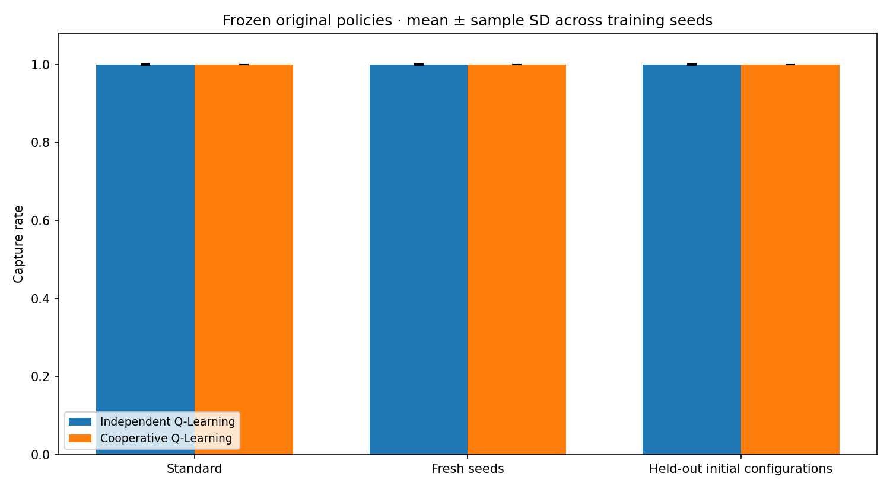
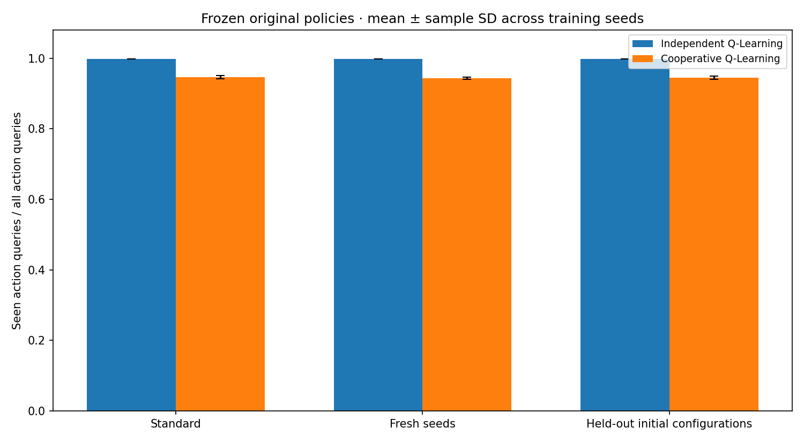
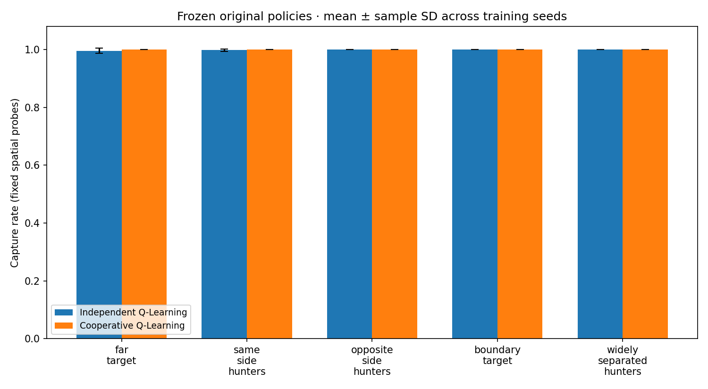

# Generalization and robustness evaluation

## Why the Phase 14 implementation was corrected

Finalization found Phase 14 source code but no saved robustness outputs. The previous runner reset the target with `seed=None` for imposed initial states and spatial stress cases, so target motion was neither reproducible nor matched between methods. Its initial-state generator ignored its exclusion argument; the tests compared robustness labels with five training-run labels instead of actual episode environment seeds. It loaded a default checkpoint directory rather than verifying original main-study provenance, reused an advancing action RNG across conditions, and did not save checkpoint identities, held-out catalogs or frozen-table checks. The analysis omitted episode reward, query denominators and per-seed deltas. The old README's “~80%” stress result had no saved evidence and has been removed.

The corrected runner preserves all environment, reward, state-encoding and learning mathematics. It uses the original full-reward Independent and Cooperative checkpoints; no training was required. Existing main, behavioral, ablation and audit evidence was preserved. Because no previous robustness artifacts existed, this study supplies the missing evidence rather than overwriting a measured study.

## Executed protocol and provenance

The saved [configuration](../results/robustness/summaries/robustness_config.json) records a 10×10 grid, 100-step horizon, five training seeds 0–4 and original 5,000-episode training budget. Every one of the 15 source checkpoint hashes matched its counterpart in `results/validation/run_b`; original run_a/run_b inventories and main summaries were revalidated. [Checkpoint identities](../results/robustness/summaries/checkpoint_identities.csv) contain source-relative paths and SHA-256 hashes. The original Cooperative hashes also agree with the Phase 13 full-reward identities.

The actual execution was:

```text
python -m experiments.run_robustness_evaluation --comparison-dir results/validation/run_a --verify-against results/validation/run_b --output-dir results/robustness
```

These ignored local source paths are historical provenance. A fresh clone first generates a main comparison in a fresh directory and supplies it with `--comparison-dir`, as shown in [reproduction instructions](reproducibility.md).

| Condition | Per method and training seed | Environment seed schedule |
|---|---:|---|
| Standard | 500 | Original 10,000,000 + 500×seed_index + episode |
| Fresh held-out seeds | 500 | 50,000,000 + 500×seed_index + episode |
| Held-out initial configurations | 500 | 51,000,000 + 500×seed_index + episode |
| Each of five spatial probes | 100 | 52,000,000 + (5×case_index + seed_index)×100 + episode |

There are 20,000 rollouts across the two methods. Each condition loads a fresh frozen policy and action RNG stream. Standard uses the original action seeds 20,000,000+2×seed_index and +1. Other conditions use 60,000,000+1,000,000×condition_index+2×seed_index and +1; primary conditions have indices 0–2 and probes 3–7. The RNG continues within a condition batch, preserving existing tie behavior. Every target reset has an explicit seed. Identical environment seeds and initial configurations are used for both methods; subsequent trajectories may diverge because policies and collisions differ.

Fresh environment ranges were checked against the complete training schedule (five intervals, index×1,000,000 through +4,999), the original 10,000,000–10,002,499 evaluation range and the prior 30,000,000–30,009,999 ablation audit range. Training-run labels 0–4 alone are insufficient to establish separation. Additional user experiments require explicit prior ranges; the runner cannot detect unrecorded histories.

For initial-state testing, all 25,000 training resets yielded 24,655 unique **ordered absolute configurations**. All 2,500 prior main evaluation configurations were also cataloged. Deterministic sampling with generator seeds 70,000,000+seed_index rejected every configuration in those catalogs and every already selected test configuration. The [held-out catalog](../results/robustness/summaries/held_out_initial_configurations.csv) has 2,500 distinct starts; the training-catalog hash is saved. This establishes absence from **source reset configurations**, not absence from all intermediate training states or encoded Q-table keys. A fresh seed alone makes no such configuration claim.

## Frozen evaluation and coverage

Policies use epsilon zero, the existing seeded random tie-breaking and zero-valued unseen states, with no fallback. Learning entry points are disabled during the study. Deep snapshots of the complete tables before/after every condition detect value changes or insertions; file hashes are also checked after evaluation. [Verification](../results/robustness/summaries/verification.json) confirms 80 unchanged-table checks and all 5,000 Standard learned-policy rows match original capture outcomes, lengths and reward exactly.

An action query counts once for each hunter before each transition, including repeated visits. For each episode `state_queries = 2 × episode_length`. “Seen” means that the method's encoded state key belongs to the fixed loaded checkpoint's key set. Per-seed coverage is **sum seen queries / sum all queries**, rather than an unweighted mean of episode ratios or a unique-state fraction. Shared-table membership is queried from each hunter's perspective. Unseen rate equals one minus coverage. Keys inserted while training include bootstrapped next states; coverage establishes table membership, not visit counts during training or reliable action values. Different state encodings make coverage a support diagnostic, not a direct comparison of representation quality.

All metrics are aggregated within training seed and then across seeds using sample SD. Successful capture time is conditional; zero-success seeds are missing. Deltas are condition-minus-Standard computed within each seed before averaging. The complete [summary](../results/robustness/summaries/robustness_summary.csv), [seed estimates](../results/robustness/summaries/per_seed_summary.csv) and [plot source](../results/robustness/summaries/plot_source.csv) include reward, unseen rate, conditional times, valid-seed counts and deltas for every metric.

## Primary results

Each row has 2,500 episodes and five seed estimates. Values are mean ± sample SD.

| Method | Condition | Capture rate | Successful time | All-episode length | Q coverage |
|---|---|---:|---:|---:|---:|
| Independent Q-Learning | Standard | 0.9992 ± 0.0011 | 20.2131 ± 0.8073 | 20.2772 ± 0.7763 | 0.9979 ± 0.0004 |
| Independent Q-Learning | Fresh seeds | 0.9992 ± 0.0011 | 20.4047 ± 0.9405 | 20.4680 ± 0.9791 | 0.9980 ± 0.0001 |
| Independent Q-Learning | Held-out starts | 0.9992 ± 0.0011 | 20.4659 ± 0.6625 | 20.5300 ± 0.6015 | 0.9978 ± 0.0003 |
| Cooperative Q-Learning | Standard | 1.0000 ± 0.0000 | 16.8412 ± 0.4470 | 16.8412 ± 0.4470 | 0.9460 ± 0.0048 |
| Cooperative Q-Learning | Fresh seeds | 1.0000 ± 0.0000 | 17.2916 ± 0.4675 | 17.2916 ± 0.4675 | 0.9436 ± 0.0033 |
| Cooperative Q-Learning | Held-out starts | 1.0000 ± 0.0000 | 17.1540 ± 0.2670 | 17.1540 ± 0.2670 | 0.9447 ± 0.0040 |

Mean capture-rate change was zero for both methods on both held-out conditions. Paired seed SD was 0.0014 for Independent fresh seeds; its failures shifted between seeds despite the same total success count. Independent all-episode length changed by +0.1908±1.2121 and +0.2528±0.9953 steps; Cooperative by +0.4504±0.4848 and +0.3128±0.6380. No significance or universal transfer claim follows.




The [performance-change figure](../results/robustness/plots/performance_drop.png) retains paired seed variability even when mean change is zero. These conditions test new same-grid starts and target/action randomness, not a radically shifted task distribution.

## Spatial probes

Each probe is one fixed configuration, repeated with 100 target seeds per trained policy (500 episodes per method). These estimates stay separate from ordinary capture rates.

| Probe | Hunter 0; hunter 1; target | Independent capture | Cooperative capture | Independent length | Cooperative length |
|---|---|---:|---:|---:|---:|
| Far target | (0,0); (0,9); (9,5) | 0.9960 ± 0.0089 | 1.0000 ± 0.0000 | 31.2800 ± 2.2739 | 33.7580 ± 1.0499 |
| Same-side hunters | (0,0); (0,1); (9,9) | 0.9980 ± 0.0045 | 1.0000 ± 0.0000 | 35.5800 ± 1.7769 | 38.4680 ± 0.9404 |
| Opposite-side hunters | (0,5); (9,5); (5,5) | 1.0000 ± 0.0000 | 1.0000 ± 0.0000 | 19.1300 ± 1.3877 | 17.6520 ± 0.9807 |
| Boundary target | (5,5); (6,5); (0,5) | 1.0000 ± 0.0000 | 1.0000 ± 0.0000 | 17.0000 ± 1.3836 | 13.2240 ± 1.5300 |
| Widely separated | (0,0); (9,9); (5,5) | 1.0000 ± 0.0000 | 1.0000 ± 0.0000 | 25.5720 ± 1.7476 | 26.5980 ± 1.2678 |

Cooperative coverage was only 0.7756, 0.7652 and 0.7661 in far-target, same-side and separated probes respectively, yet all succeeded. This contradicts any assertion that unseen keys necessarily cause failure or that coverage alone establishes the cause of failure. Cooperative duration exceeded Independent in those three probes. Standard performance does not imply uniform efficiency superiority.



## Diagnostics and limits

Selection is predetermined: lowest nonstandard mean capture-rate condition per method (ties by condition name); first failure ordered by training/evaluation seed. If none fail, use the longest successful episode, with the same tie order. [Selection records](../results/robustness/summaries/diagnostic_selection.csv) and two actual trajectories accompany path figures.

Independent's selected far-target failure is seed 4 / environment 52,000,443, truncated at 100 steps. Cooperative has no failure in any tested condition; its selected long success is seed 2 / environment 51,001,415, captured at step 86. These are diagnostics, not typical examples or rate estimates. [Initial-geometry summaries](../results/robustness/summaries/initial_geometry_summary.csv) describe distance sum, hunter separation and target boundary distance by outcome and seed. Rare failures and only five fixed probes do not support a systematic geometric causal claim.

Grid-size transfer is excluded: absolute and relative table supports, state aliasing and boundary information change with grid size. This study isolates reset/seed and spatial robustness within the original grid. Five trained policies, one target strategy, saturation in finite samples and coupled representation/sharing limit conclusions. The held-out catalog concerns resets only. Lower coverage does not directly measure uncertainty, and descriptive SD is not statistical significance. The Phase 13 fresh-seed capture audit remains a separate investigation of reward variants; this study evaluates the original two main learned methods with all required conditions.

Raw rollouts are retained locally at `results/robustness/raw/robustness_raw.csv` and ignored. Selected configurations, identities, summaries, sources, figures, diagnostic trajectories and verification ship with the release. The [manifest](../results/robustness/summaries/artifact_manifest.json) includes the ignored raw file and defines the original complete study inventory. Fast tests exercise episode-range exclusions, catalog exclusions, geometry, frozen tables, deterministic matched rollouts, query denominators, paired deltas, complete repeated pipelines and rejection of corrupt saved data.
